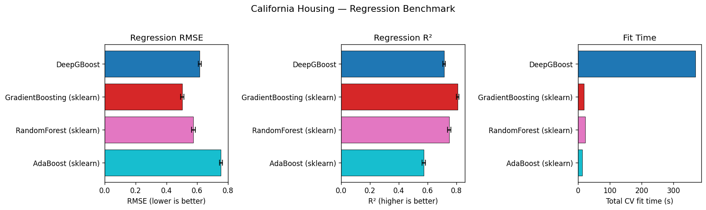
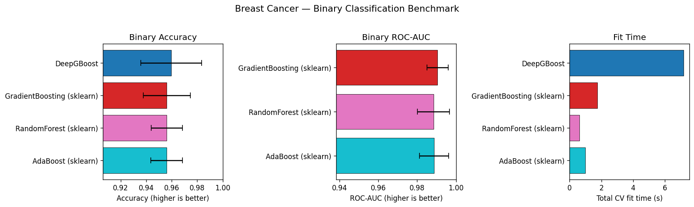
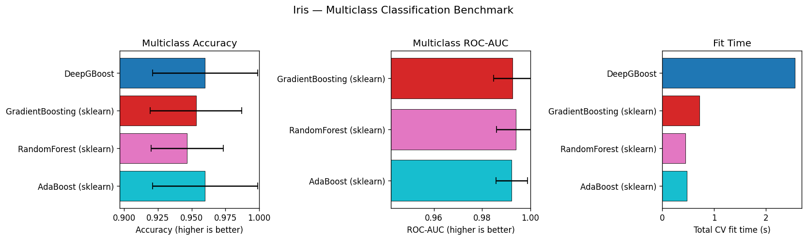

# DeepGBoost Benchmark Results

All scores are 5-fold cross-validation means ± std.

## Environment

- Python 3.13.5chr(10)- deepgboost==0.1.0chr(10)- scikit-learn==1.8.0chr(10)- numpy==2.4.4

---

## 1. Regression — California Housing

| Model | Fit time (s) | RMSE (mean) | RMSE (std) | R2 (mean) | R2 (std) |
| --- | --- | --- | --- | --- | --- |
| DeepGBoost | 368.83 | 0.616 | 0.0094 | 0.7149 | 0.0084 |
| GradientBoosting (sklearn) | 18.71 | 0.5036 | 0.0114 | 0.8094 | 0.0088 |
| RandomForest (sklearn) | 22.57 | 0.5753 | 0.013 | 0.7513 | 0.0109 |
| AdaBoost (sklearn) | 13.15 | 0.754 | 0.0089 | 0.5728 | 0.0116 |

---

## 2. Binary Classification — Breast Cancer

| Model | Fit time (s) | Accuracy (mean) | Accuracy (std) | ROC-AUC (mean) | ROC-AUC (std) |
| --- | --- | --- | --- | --- | --- |
| DeepGBoost | 7.19 | 0.9596 | 0.0239 | nan | nan |
| GradientBoosting (sklearn) | 1.76 | 0.9561 | 0.0184 | 0.9905 | 0.0055 |
| RandomForest (sklearn) | 0.63 | 0.9561 | 0.0123 | 0.9884 | 0.0083 |
| AdaBoost (sklearn) | 0.99 | 0.9561 | 0.0124 | 0.9887 | 0.0075 |

---

## 3. Multiclass Classification — Iris

| Model | Fit time (s) | Accuracy (mean) | Accuracy (std) | ROC-AUC (mean) | ROC-AUC (std) |
| --- | --- | --- | --- | --- | --- |
| DeepGBoost | 2.56 | 0.96 | 0.0389 | nan | nan |
| GradientBoosting (sklearn) | 0.72 | 0.9533 | 0.034 | 0.9927 | 0.008 |
| RandomForest (sklearn) | 0.44 | 0.9467 | 0.0267 | 0.994 | 0.008 |
| AdaBoost (sklearn) | 0.47 | 0.96 | 0.0389 | 0.9923 | 0.0066 |

